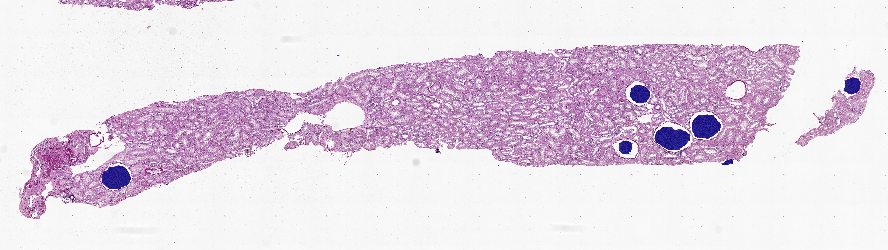
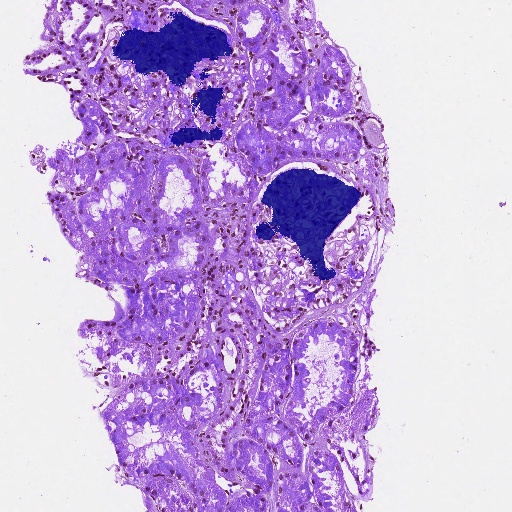
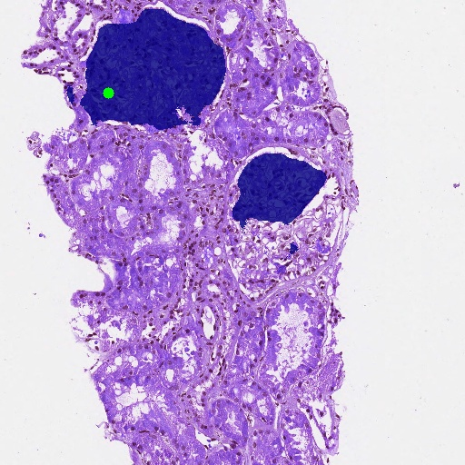
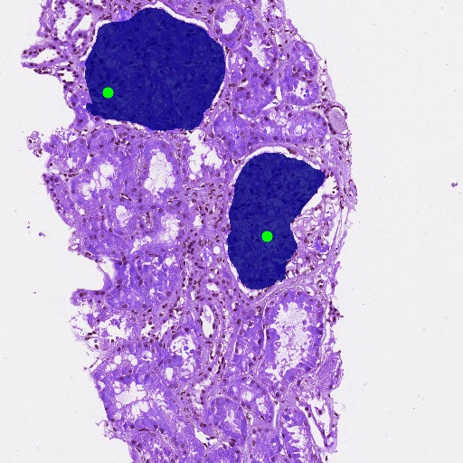
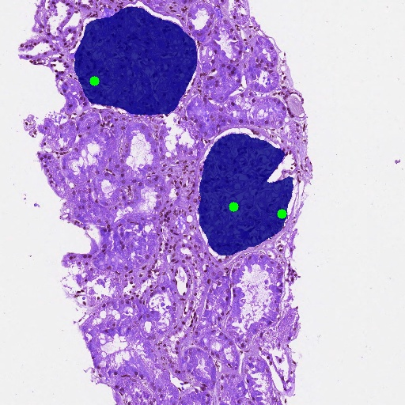
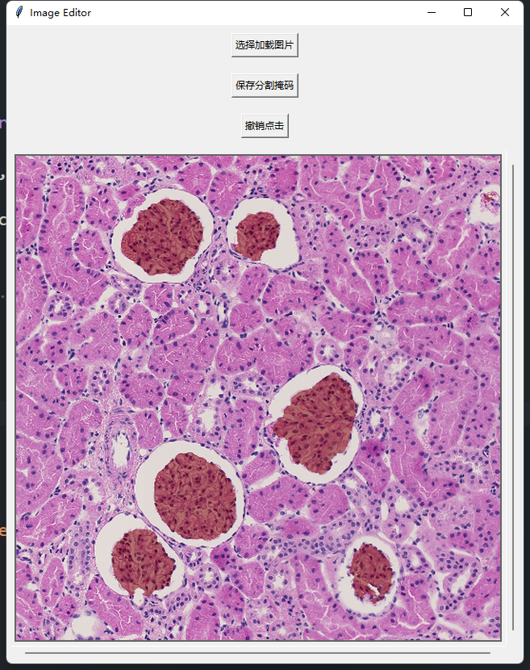
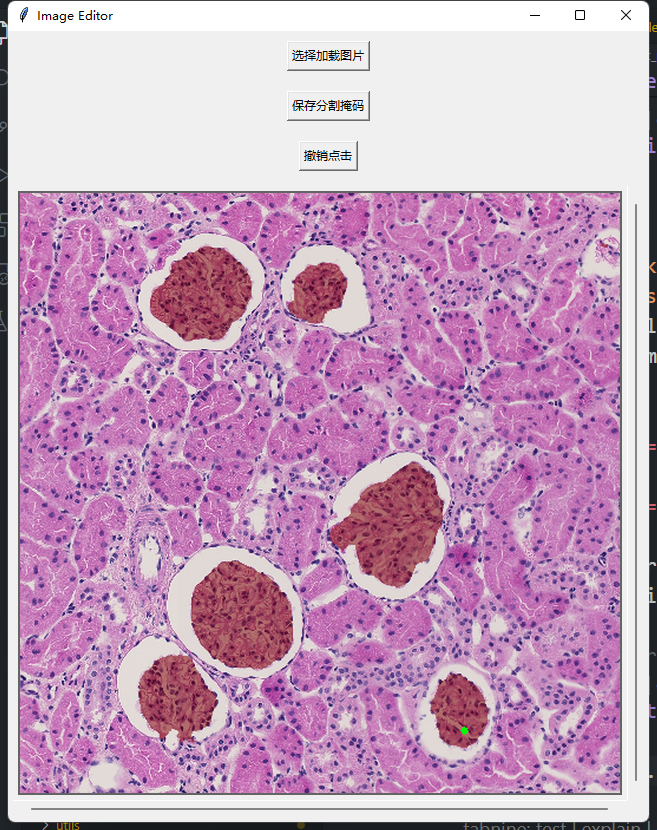
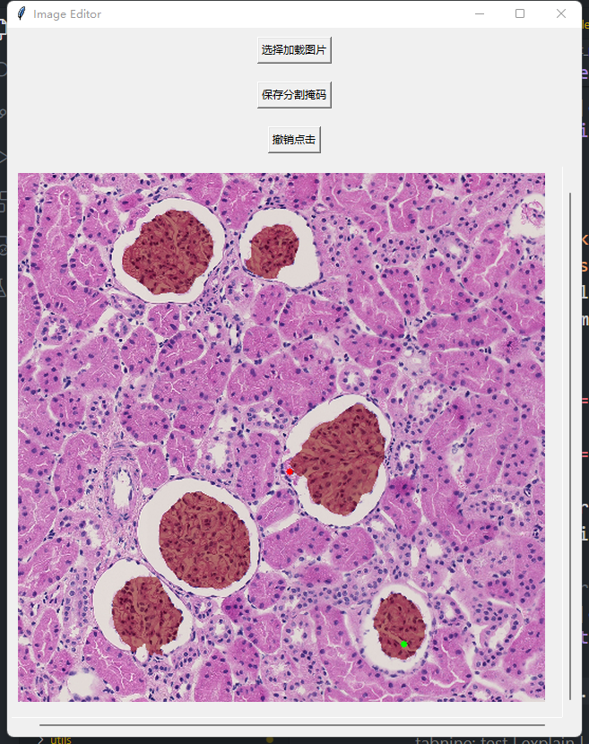

# Click-UNet

In this project, we designed a Unet model capable of performing automatic segmentation tasks and incorporating interactive information for corrections. Additionally, we developed an interactive annotation tool based on this model to facilitate the segmentation process.  

- Whole slide image result:


- Result with click:
<p align="center">
  
  
  
  
</p>

## Abstract
Analysis of glomerular tissue structure on the 
high-resolution whole slide images (WSIs) from a renal biopsy is 
of great significance in diagnosis and treatment of kidney disease. 
Intelligent segmentation pipelines can greatly help pathologists 
improve the identification efficiency of glomerular regions on 
WSIs. However, publicly available annotated datasets of 
glomerulus are very rare and it is very time-consuming for the 
pathologists to label the whole WSIs. Therefore, this paper 
presents an interactive glomerulus labeling approach directly on 
WSIs, in which we aim to segment all glomerular targets at once 
(the glomerular category) with minimal interaction cost. Existing 
deep learning-based interactive segmentation methods are not 
suitable for this task due to 1) local spatial guidance signals are 
not supported to select a category, 2) the first interaction is 
ambiguous for the single target extraction, 3) excessive interaction 
burden on the whole WSIs, etc. To address the above issues, we 
design a bidirectional coupling encoder first to effectively 
integrate images and user interaction information, which helps to 
enhance the compatibility and attention of user intentions in the 
network. We combine the automatic and interactive segmentation 
tasks for the annotation problem of the single glomerular category 
on WSIs. For these two independent tasks, an order encoding 
strategy is utilized to connect the entire annotation process in a 
single network based on the iterative training, which helps to 
learn the potential sequence correlations starting from the “0th 
click”. Furthermore, a label diffusion model is developed by 
exploring the implicit category activation information, utilized to 
enrich the expression of user intent for the glomerular category. 
Experiments on the real WSIs of renal biopsy demonstrate that 
the proposed method can be used as a practical tool for labeling 
glomeruli and achieves significant improvement in annotation 
efficiency compared to state-of-the-art methods. 

## Installation
This framework is built using Python 3.8.16 and relies on the PyTorch 1.10.1. The following command installs all necessary packages:
```
conda create --name <env> --file requirements.txt
```

## Interactive Segmentation Demo
Use our interactive tool by running the following script.
```
python app.py  # The files are located in the demo folder.
```
- Demonstration of Results
<p align="center">
  
  
  
</p>

## Datasets
The datasets used for training and testing can be downloaded from this [link]().
## Train
Train the model using the following script. The model was trained using a single NVIDIA RTX 4090 GPU.
```
python train_iter.py
```
## Test
Test the model using the following script.
```
python test_iter.py # normal images
python test_wsi.py # wsi
```
## Acknowledgments
This code is inspired by Omni-Seg+
## License
The code is released under the MIT License. It is a short, permissive software license. Basically, you can do whatever you want as long as you include the original copyright and license notice in any copy of the software/source.
